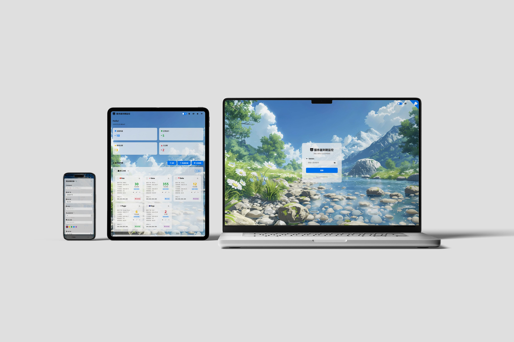
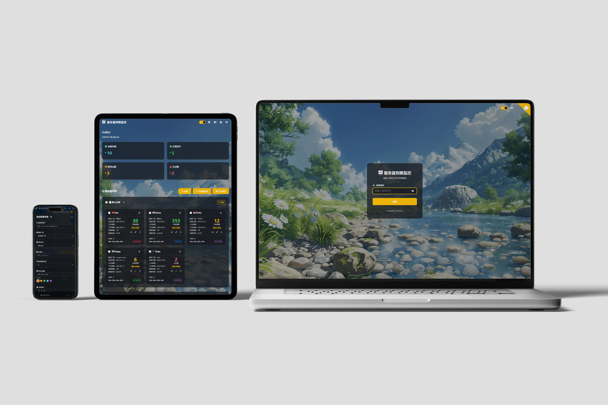
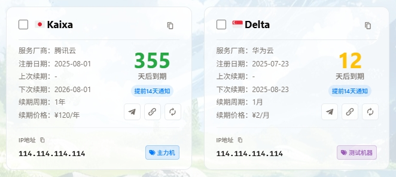
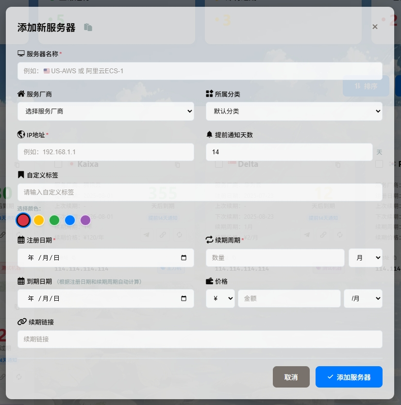
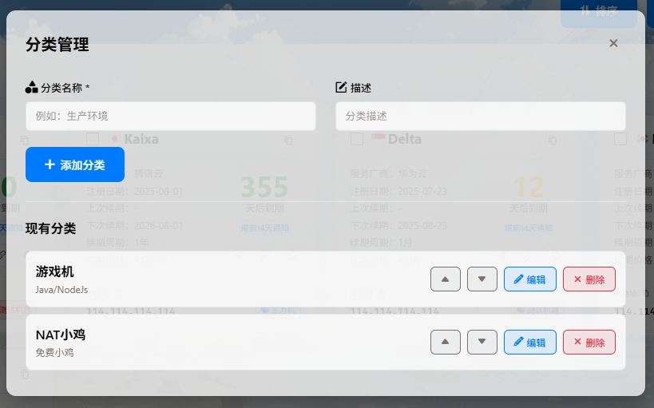

# 🖥️CF-Server-Autocheck

## 🚨本项目主要是参考了`NEZHA V1`面板并通过和Ai沟通创作而成，有能力的小伙伴可自行进行完善或魔改🚨

### 项目起源：
* 目前nezha v1面板虽然能通过添加json格式的代码对服务器到期时间进行监控，但是却没有办法进行到期提醒
* 尤其是有一些需要定期签到或登录的游戏机/小鸡来说，非常之不方便，而且自己又不会修改nezha面板的源码
* 因此就自己动手丰衣足食，写了这个小项目工具，用来专门监控服务器的到期情况，并进行telegram通知，同时支持添加NEZHA面板外链接

### 项目功能：
服务器到期监控、telegram自动通知、背景图更换、主题切换、链接哪吒监控网址(只是链接网址)
> ⚠️ 想要域名监控功能的小伙伴请看这里：https://github.com/kamanfaiz/CF-Domain-AutoCheck ⚠️

-------------------------------------------------------------------------------------------

## 💻界面展示

    
其他页面效果展示

-------------------------------------------------------------------------------------------

## 📌显示逻辑
### 一、卡片剩余天数展示逻辑
| 判定条件                    | 统计状态   | 卡片剩余天数颜色 |
|:----------------------------|:-----------|:-----------------|
| 剩余天数小于等于0天         | ❌已过期    | 🔴红色           |
| 剩余天数小于等于周期天数50% | 📢即将过期 | 🟡黄色           |
| 剩余天数大于周期天数50%     | ✅正常      | 🟢绿色           |

### 二、Telegram通知逻辑
| 判定条件               | 提前天数                     |
|:-----------------------|:-----------------------------|
| 未单独设置提前通知天数 | 采用默认全局控制，默认是14天 |
| 单独设置了提前通知天数 | 根据自定义的提前通知天数     |

-------------------------------------------------------------------------------------------

## 🚀简易部署流程，若需要详细流程，请移步👉[Faiz博客](https://blog.faiz.hidns.co/2025/08/12/Server-AutoCheck%E6%9C%8D%E5%8A%A1%E5%99%A8%E5%88%B0%E6%9C%9F%E7%9B%91%E6%8E%A7/)
1. 创建workers，粘贴代码
2. 创建一个KV，名字可以随便取
3. 绑定KV，变量名称：`SERVER_MONITOR`，注意大写，怕填错就复制粘贴，KV命名空间就下拉菜单选择刚才创建的KV名
4. 绑定自定义域名
5. 设定环境变量，cloudflare环境变量名如下：

    > 先级都是：Cloudflare环境变量＞代码中的变量＞默认值🚨

    | 名称     | 示例                                                                     | 必填 | 备注                     |
    |:---------|:-------------------------------------------------------------------------|:----:|:-------------------------|
    | PASS     | 默认为空                                                                 |  ✅️   | 登录密码，最好自定义一下 |
    | TG_TOKEN | telegram找[@BotFather](https://t.me/BotFather)获取                       |  ❌️   | 可在界面后端配置         |
    | TG_ID    | telegram找[@userinfobot](https://t.me/userinfobot)获取，或者群机器人也行 |  ❌️   | 可在界面后端配置         |
6. 其他的自定义内容，例如：网站标题、logo、欢迎语、背景图等，都可以在网页端单独设置
7. 按照上述变量名添加完telegram变量后，点击`设置`——点击`触发事件`——点击`添加`——选择`cron触发器`——选择`一周中的某一天`——自定义时间
    > 🚨这里面的时间不是北京时间，是UTC时间，与北京时间相差8小时，例如设置为00:00，那么会在北京时间08:00进行通知🚨
8. 如果是本地网络首次部署的小伙伴，发现没有默认的背景图，只要开启一下代理即可，因为默认的背景图资源等都是直接链接github仓库的，可能首次加载需要开启代理进行缓存。
-------------------------------------------------------------------------------------------

## 代码更新方式
功能基本没有问题，一般不太会更新功能方面的内容，只可能修复一些用户体验类的bug，这些都不影响整体功能的使用，只有强迫症患者才需要更新。如果代码更新了，只需要重新复制粘贴代码可，因为域名数据都是储存在KV里面的，只要不动KV空间，就不会出现数据丢失。
> 🚨如果是喜欢在代码中填写变量的小伙伴，记得重新复制代码前保存好自己设置的变量。
